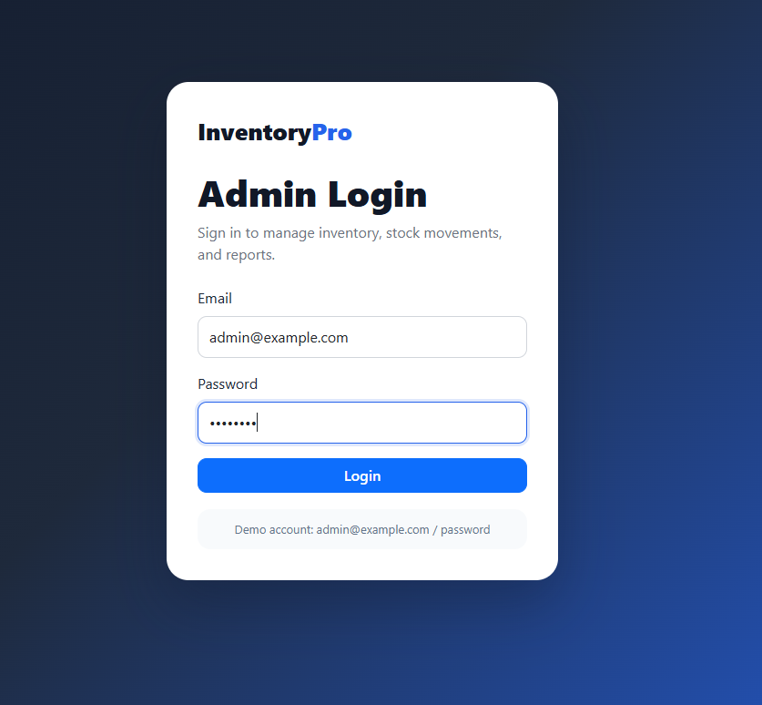
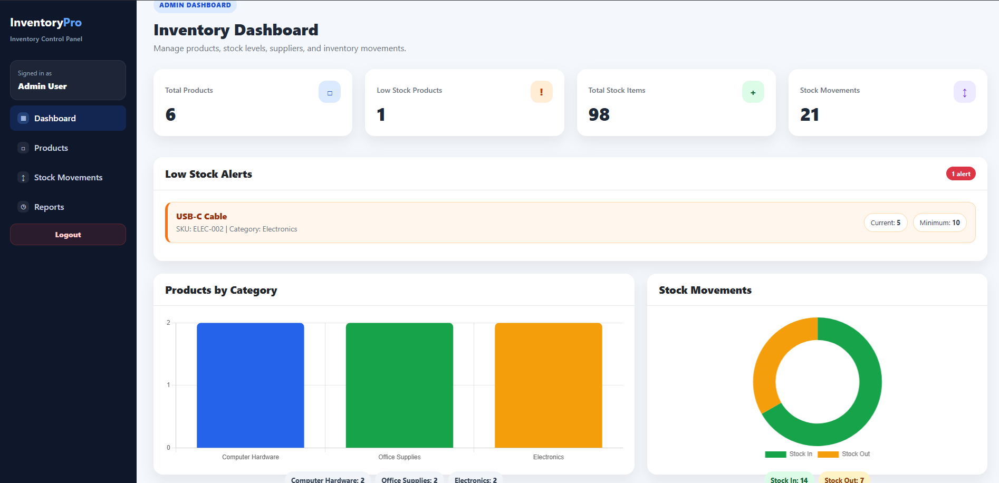
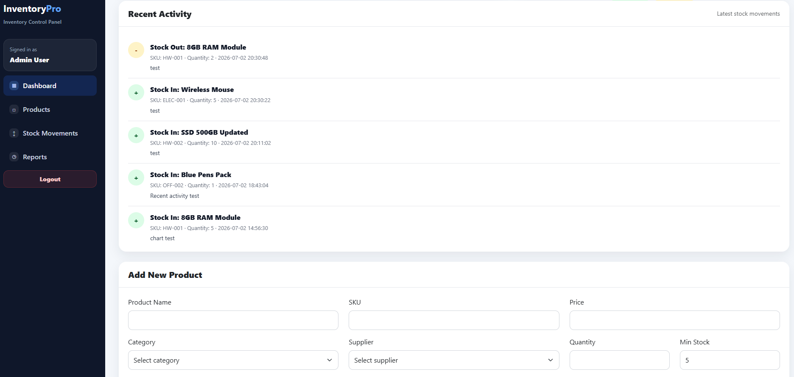
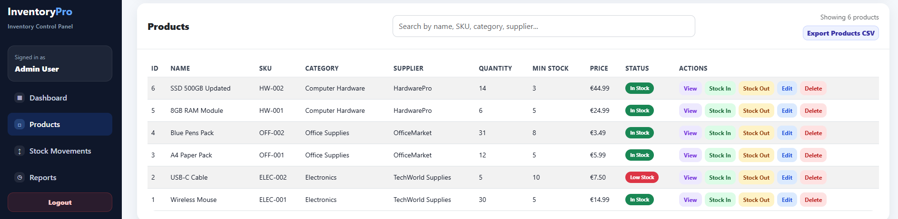
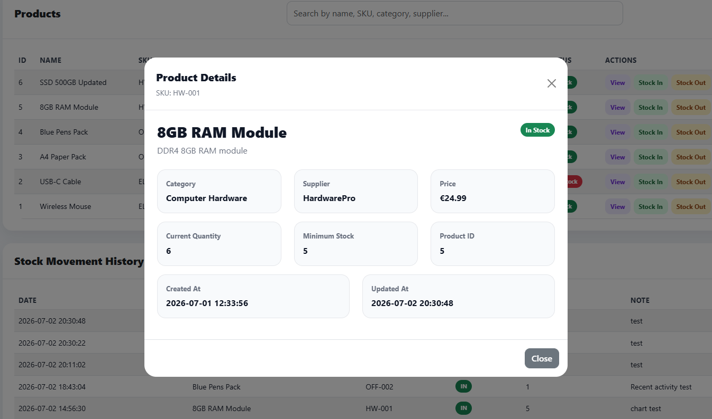
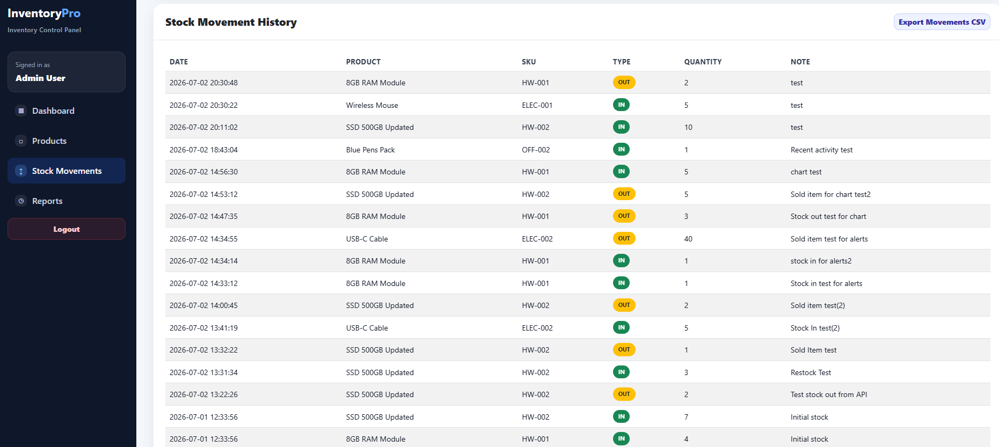

# InventoryPro - Inventory Management System

InventoryPro is a full-stack inventory management dashboard built with PHP, Slim Framework, MySQL, JavaScript, Bootstrap and Chart.js.

The application allows an admin user to manage products, track stock movements, monitor low-stock products, view analytics, export CSV reports and access the dashboard through a login system.

---

## Screenshots

### Login Screen


### Dashboard Overview


### Dashboard Analytics


### Products Table


### Product Details Modal


### Stock Movements


---

## Features

- Admin login system with token-based authentication
- Protected API endpoints
- Product CRUD operations
- Product details modal
- Stock In and Stock Out actions
- Stock movement history
- Low stock alerts
- Dashboard summary cards
- Products by category chart
- Stock In vs Stock Out chart
- Recent activity timeline
- Product search/filter
- CSV export for products
- CSV export for stock movements
- Responsive admin dashboard UI

---

## Tech Stack

### Backend
- PHP
- Slim Framework
- MySQL
- PDO
- Composer

### Frontend
- HTML
- CSS
- JavaScript
- Bootstrap
- Chart.js

### Tools
- XAMPP
- phpMyAdmin
- Git / GitHub

---

## Demo Login

```text
Email: admin@example.com
Password: password
```


## Project Structure

```text
inventory-system/
│
├── backend/
│   ├── public/
│   │   └── index.php
│   ├── src/
│   │   └── config/
│   │       └── database.php
│   ├── composer.json
│   └── composer.lock
│
├── database/
│   ├── schema.sql
│   ├── seed.sql
│   └── auth.sql
│
├── frontend/
│   ├── assets/
│   │   ├── css/
│   │   │   └── style.css
│   │   └── js/
│   │       └── app.js
│   └── index.html
│
├── screenshots/
│   ├── 01-login-screen.png
│   ├── 02-dashboard-overview.png
│   ├── 03-dashboard-analytics.png
│   ├── 04-products-table.png
│   ├── 05-product-details-modal.png
│   └── 06-stock-movements.png
│
├── .gitignore
└── README.md
```

Installation & Setup

1. Clone the repository

git clone https://github.com/YOUR-USERNAME/inventory-system.git
cd inventory-system

2. Start XAMPP

Start:
Apache
MySQL

3. Create the database

Open phpMyAdmin:
http://localhost/phpmyadmin
Create a database named:
inventory_system
Then import/run the SQL files in this order:
database/schema.sql
database/seed.sql
database/auth.sql

4. Install backend dependencies

Go to the backend folder:
cd backend
composer install

5. Configure database connection

Create a .env file inside the backend folder.
Example:
DB_HOST=localhost
DB_NAME=inventory_system
DB_USER=root
DB_PASS=

6. Start the backend server

From the backend folder, run:
php -S localhost:8080 -t public
Test endpoint:
http://localhost:8080/api/health

7. Open the frontend

Open this file in your browser:
frontend/index.html
or use the full local path:
file:///C:/Users/User/Desktop/inventory-system/frontend/index.html

API Endpoints

Authentication
POST /api/login
GET  /api/me
POST /api/logout

Products
GET    /api/products
POST   /api/products
PUT    /api/products/{id}
DELETE /api/products/{id}

Categories
GET /api/categories

Suppliers
GET /api/suppliers

Stock Movements
GET  /api/stock-movements
POST /api/stock-movements

Main Functionality

Product Management

The admin can create, view, update and delete products. Each product includes category, supplier, SKU, quantity, minimum stock, price and description.

Stock Management

The dashboard supports Stock In and Stock Out actions. Each stock action updates the product quantity and creates a stock movement record.

Low Stock Alerts

Products with quantity less than or equal to their minimum stock are automatically shown in the Low Stock Alerts panel.

Analytics

The dashboard includes charts for:
Products by category
Stock In vs Stock Out movements

CSV Export

The admin can export:
Products list
Stock movement history
Authentication Notes

The project uses a simple token-based authentication system for portfolio/demo purposes.

After login, a token is stored in localStorage and sent with protected API requests using the Authorization: Bearer <token> header.

Future Improvements
User roles and permissions
Password reset flow
Pagination for large product lists
Advanced filtering by category and supplier
Date filtering for stock movements
Deployment with hosted backend and database

About This Project

This project was built as a practical portfolio project to demonstrate full-stack development skills using PHP, MySQL, REST APIs and a modern JavaScript frontend.

It focuses on real-world inventory management features such as product CRUD, stock tracking, alerts, analytics, authentication and CSV export.